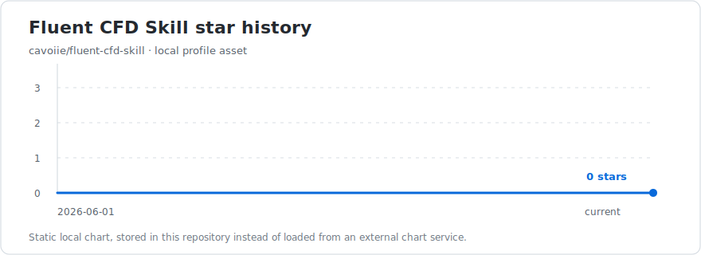

# CFD, PyFluent, and AI-assisted simulation workflows

English | [简体中文](README.zh-CN.md)

I work on practical CFD workflows around Ansys Fluent, PyFluent, and agent-assisted simulation tooling.

My current focus is making simulation setup, solver automation, convergence checks, and validation steps more explicit and reproducible.

## Featured Project

### [Fluent CFD Skill](https://github.com/cavoiie/fluent-cfd-skill)

A Codex skill for Ansys Fluent and PyFluent CFD workflows. It provides a compact workflow layer for:

- Fluent case setup and review
- Boundary-condition and mesh-quality checks
- Turbulence model and wall-treatment decisions
- Residual, monitor, and conservation-based convergence assessment
- PyFluent MCP tool-use discipline for local Fluent automation

## Tooling

- Ansys Fluent and PyFluent
- Model Context Protocol (MCP)
- Python automation for simulation workflows
- Codex skills for reusable engineering procedures

## Engineering Interests

- Reliable CFD workflow design
- Simulation validation and convergence criteria
- Fluent/PyFluent automation
- Human-in-the-loop agent workflows for engineering analysis

## Project Stars

